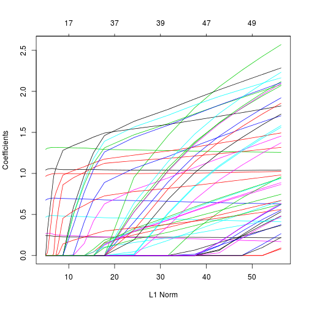

Introduction to adrminer
========================================================


Installing the package
------------------------
Installing `ADRminer` should be rather straightforward. `ADRminer` relies on several R packages which should be automatically downloading when installing it. The only exception is LBE which is held on the Bioconductor repository and that can be install with the following command:


```r
source("http://bioconductor.org/biocLite.R")
biocLite("LBE")

install.packages("`ADRminer`")
```


From data.frames to ADRminer objects
--------------------------------------------------------
All functions implemented in `ADRminer` relie on two ADRminer S4 objects: pvCont and pvInd. Briefly, pvCont contain aggregated pharmacovigilance data, *i.e.* number of spontaneous reports associated with adverse drug - events pairs. By contrast, if dealing with data at individual level, pvInd should be prefered, especially if one is interested in including individual convariates in the analysis.
`ADRminer` includes toy datasets which will be used throughout this tutorial to illustrate its functionnalities

### Creating a pvInd object

Let's start with sr1 which takes the form of a 3 column data.frame

```r
library(ADRminer)  ### load `ADRminer`
```

```
## Loading required package: LBE
## Loading required package: Matrix
```

```r

data(sr1)
head(sr1)
```

```
##   id  drugId     aeId
## 1 i1 L01AA01 10029330
## 2 i2 B05XB03 10002646
## 3 i3 C07AA05 10020955
## 4 i4 J01EA01 10018800
## 5 i5 N06AA09 10010922
## 6 i6 N05AF05 10029282
```

These are
* a patient identifier for the ADR
* the corresponding drug label 
* the corresponding adverse event label

This dataset can be easily transformed into an pvInd object

```r
pvIndSr1 <- pvInd(adr = sr1)
pvIndSr1
```

```
## S4 class: pvInd 
## 
## @drug:  17282 x 1163 , Drug sparse matrix:
##        A01AA01 A01AA02 A01AB02 A01AB03 A01AB04 A01AB09
## i1           0       0       0       0       0       0
## i10          0       0       0       0       0       0
## i100         0       0       0       0       0       0
## i1000        0       0       0       0       0       0
## i10000       0       0       0       0       0       0
## i10001       0       0       0       0       0       0
## @ae:  17282 x 829 , AE sparse matrix:
##        10000060 10000085 10000125 10000231 10000287 10000389
## i1            0        0        0        0        0        0
## i10           0        0        0        0        0        0
## i100          0        0        0        0        0        0
## i1000         0        0        0        0        0        0
## i10000        0        0        0        0        0        0
## i10001        0        0        0        0        0        0
```

```r
names(pvIndSr1)
```

```
## [1] "drug"     "ae"       "dMargin"  "aeMargin" "cov"
```


Typing pvIndSR1 into the console (equivalent to show(pvIndSR1) only display a summary of the object created. This object is made of 
* two (sparse) matrices, *i.e.* the drug matrix and the ae event matrix, 
* the drug and ae count margin,

Using the `names` function list the slots of the `pvIndSR1` object.

pvInd object was created in order to handle additionnal individual covariates which makes it possible to run stratified analyses. This covariate dataset should include a patient identifier in the first column. Note that the identifier for both adr and covariates data do not need to match exactly: patients in the covariate dataset but not in the adr dataset will be removed whereas missing value will be added for patient only present in the adr dataset.

The covariates that will be used for conducting stratified analyses should be converted into factors and it is advised to do so before converting the raw data into a pvInd object. For instance in covSr1, neither sex nor age is a factor


```r
data(covSr1)
head(covSr1)
```

```
##   id sex age
## 1 i1   2  56
## 2 i2   2  78
## 3 i3   2  95
## 4 i4   1  38
## 5 i5   2  67
## 6 i6   1  55
```

```r
class(covSr1$sex)
```

```
## [1] "numeric"
```

```r
class(covSr1$age)
```

```
## [1] "numeric"
```


Converting sex is straightforward

```r
covSr1$sexFactor <- factor(covSr1$sex, exclude = NULL)  ## exclude=NULL allows to consider NA values as a factor level
summary(covSr1$sexFact)
```

```
##    1    2 <NA> 
## 7851 9383   48
```

```r
nlevels(covSr1$sexFact)
```

```
## [1] 3
```

```r
head(covSr1)
```

```
##   id sex age sexFactor
## 1 i1   2  56         2
## 2 i2   2  78         2
## 3 i3   2  95         2
## 4 i4   1  38         1
## 5 i5   2  67         2
## 6 i6   1  55         1
```


In order to transform age into a categorical variable, one can use the cut() command

```r
covSr1$ageFactor <- cut(covSr1$age, breaks = c(0, 3, 10, 18, 40, 65, 110), include.lowest = T)
covSr1$ageFactor <- factor(covSr1$ageFactor, exclude = NULL)
summary(covSr1$ageFactor)
```

```
##    [0,3]   (3,10]  (10,18]  (18,40]  (40,65] (65,110]     <NA> 
##      571      321      610     3760     5521     6303      196
```


Now, we are ready to create a pvInd object including covariate information

```r
pvIndSr1 <- pvInd(adr = sr1, cov = covSr1)
pvIndSr3 <- pvInd(adr = sr1)
pvIndSr1
```

```
## S4 class: pvInd 
## 
## @drug:  17282 x 1163 , Drug sparse matrix:
##        A01AA01 A01AA02 A01AB02 A01AB03 A01AB04 A01AB09
## i1           0       0       0       0       0       0
## i10          0       0       0       0       0       0
## i100         0       0       0       0       0       0
## i1000        0       0       0       0       0       0
## i10000       0       0       0       0       0       0
## i10001       0       0       0       0       0       0
## @ae:  17282 x 829 , AE sparse matrix:
##        10000060 10000085 10000125 10000231 10000287 10000389
## i1            0        0        0        0        0        0
## i10           0        0        0        0        0        0
## i100          0        0        0        0        0        0
## i1000         0        0        0        0        0        0
## i10000        0        0        0        0        0        0
## i10001        0        0        0        0        0        0
## @cov: Covariate data.frame:
##        sex age sexFactor ageFactor
## i1       2  56         2   (40,65]
## i10      2  27         2   (18,40]
## i100     2  93         2  (65,110]
## i1000    1  68         1  (65,110]
## i10000   1  72         1  (65,110]
## i10001   1  72         1  (65,110]
```


### Creating a pvCont object
ADRminer also handle aggregated data. The corresponding ADRminer object is pvCont which can be prefered to pvInd when using disproportionality methods (without stratification) as it is less memory (RAM) demanding.
The easiest way to build a pvCont object is to use as input a 3 column data.frame with
* the drug label
* the ae label
* the number of adr for the corresponding pair


```r
data(sr2)
pvContSr2 <- pvCont(sr2)
# res2 <- gps(pvContSr2) print(res2$convergence) res1 <- gps(pvIndSr1)
# print(res1) res3 <- gps(pvIndSr3) print(res3)
```


### Object manipulation

#### Removing ae and/or drug with too few data support

pvIndResize can be used to remove drugs for which the marginal number of reports, *i.e.* the total number of reports in which the drug is involved is less than a given number. The same can be done for removing rare ae.


```r
pvIndSr1Red <- pvIndResize(pvIndSr1, aeMarginMin = 50, dMarginMin = 50)
pvIndSr1Red
```

```
## S4 class: pvInd 
## 
## @drug:  17282 x 102 , Drug sparse matrix:
##        A01AD05 A02BA02 A02BC01 A03FA01 A07AA09 A07EA03
## i1           0       0       0       0       0       0
## i10          0       0       0       0       0       0
## i100         0       0       0       0       0       0
## i1000        0       0       0       0       0       0
## i10000       0       0       0       0       0       0
## i10001       0       0       0       0       0       0
## @ae:  17282 x 84 , AE sparse matrix:
##        10000085 10001497 10001507 10001551 10002071 10002199
## i1            0        0        0        0        0        0
## i10           0        0        0        0        0        0
## i100          0        0        0        0        0        0
## i1000         0        0        0        0        0        0
## i10000        0        0        0        0        0        0
## i10001        0        0        0        0        0        0
## @cov: Covariate data.frame:
##        sex age sexFactor ageFactor
## i1       2  56         2   (40,65]
## i10      2  27         2   (18,40]
## i100     2  93         2  (65,110]
## i1000    1  68         1  (65,110]
## i10000   1  72         1  (65,110]
## i10001   1  72         1  (65,110]
```


Stratified analyses with disproportionnality methods
--------------------------------------------------------


```r
toto <- pvPen(pvIndSr1, cov = c("sexFactor", "ageFactor"))
```

```
## [1] 17282     8
## 6 x 8 sparse Matrix of class "dgCMatrix"
##   sexFactor_2 sexFactor_NA ageFactor_(3,10] ageFactor_(10,18]
## 1           1            .                .                 .
## 2           1            .                .                 .
## 3           1            .                .                 .
## 4           .            .                .                 .
## 5           .            .                .                 .
## 6           .            .                .                 .
##   ageFactor_(18,40] ageFactor_(40,65] ageFactor_(65,110] ageFactor_NA
## 1                 .                 1                  .            .
## 2                 1                 .                  .            .
## 3                 .                 .                  1            .
## 4                 .                 .                  1            .
## 5                 .                 .                  1            .
## 6                 .                 .                  1            .
## [1] 17282
## NULL
```

```r
plot(toto)
```

 


